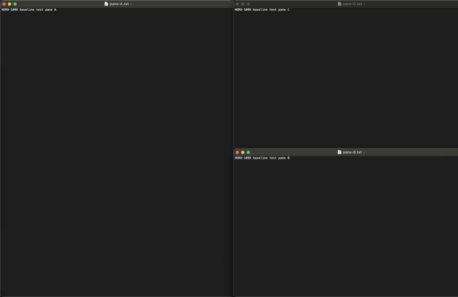

# Baseline verification

Phase 1 builds a Scene Core *above* an inherited engine. When something misbehaves then, the first
question will be "did we break this, or has it always worked this way?" — and that question is only
answerable if somebody wrote down how the inherited engine behaved before SceneMux changed anything.

This is that record. It is deliberately short: measured behaviour, the surprises, and the things
that were *not* verified. Provenance facts live in [`../legal/ORIGIN.md`](../legal/ORIGIN.md); how to
adopt upstream work lives in [`upstream-sync.md`](upstream-sync.md).

## What was measured, and on what

| | |
| --- | --- |
| SceneMux commit | `517ac2bc` (branch `phase-0/HORO-1099/upstream-baseline`) |
| Build | `make build VERSION=0.0.0` — SPM debug, zero warnings |
| Unit tests | `swift test` — 565 tests, 0 failures |
| macOS | 15.7.7 (24G720), Apple silicon |
| Toolchain | Swift 6.2.4 via `swiftly` (pinned by `.swift-version`), Xcode 26.2, macOS 26.2 SDK |
| Displays | Built-in Retina Display 1728x1117 (main) + DELL S2722DC 2560x1440 |

The macOS 26 SDK is not optional: `Sources/AppBundle/ui/core/DesignTokens.swift` calls
`glassEffect` behind an `if #available(macOS 26.0, *)` check, and a runtime availability check still
needs the symbol at compile time. Xcode 26 on macOS 15 is enough — the *SDK* is what matters, not the
running OS.

The measurements come from two contained passes. The multi-monitor row was taken with both displays
attached; the focus rows are from a second pass after a machine restart, with the built-in display
alone.

## The Accessibility permission path

`checkAccessibilityPermissions()` (`Sources/AppBundle/util/accessibility.swift`) runs at startup. If
the process is not trusted it calls `tccutil reset Accessibility <bundle id>` — because macOS does
not drop a stale grant when an app's signature changes — and then **terminates the app**. There is no
degraded mode: an untrusted build exits.

Three consequences worth knowing before an interactive pass:

* **Debug and release builds hold separate grants.** The identifiers are
  `com.chisanan232.scenemux.debug` and `com.chisanan232.scenemux`.
* **A build launched from a terminal inherits the terminal's grant.** TCC attributes the request to
  the *responsible* process, which for `./.debug/SceneMuxApp` is the terminal application. So
  `make run` works as soon as the terminal itself has Accessibility, and a double-clicked
  `SceneMux.app` needs its own grant in System Settings → Privacy & Security → Accessibility.
* **`scenemux doctor` is the cheapest check.** It prints `accessibility: granted` /
  `screen capture: granted`, the monitors, the manager state and per-app AX latency, without moving a
  single window.

## Exercising a tiling window manager on a machine you are using

Launching this engine with its defaults rearranges every window on the display. The whole baseline
below was measured on a working machine without disturbing it, using three controls together:

1. `--read-only` for the first pass. `ServerArgs.isReadOnly` makes the AX `set` path return early, so
   the app observes and reports but never mutates a window.
2. A config that opts out of everything automatic, for the mutating pass:

   ```toml
   automatically-tile-new-windows = false
   auto-add-new-windows-to-tab-group = false
   enable-shake-to-toggle-tiling = false
   shortcuts-preset = 'none'
   start-at-login = false
   auto-reload-config = false
   on-focused-monitor-changed = []

   [mode.main.binding]        # deliberately empty: no key can move a window by accident
   ```

   With `automatically-tile-new-windows = false`, `bindingDataForNewRegularWindow` floats every newly
   detected window, so nothing is tiled until it is asked for by id.
3. **Every mutating command targeted by `--window-id`**, never by focus, and only ever at throwaway
   TextEdit windows.

Containment held for geometry. In neither pass was a window other than the throwaway ones named in a
mutating command. In the first pass every window that was observable when the session started — four
of them — had a byte-identical frame, layout and workspace afterwards, and at the end all fifteen
remaining windows were `floating`, plus the one that was already `macos_native_fullscreen`, with no
tab group left behind.

Two things the controls above did *not* contain, both worth knowing before the next pass:

* **Focus.** A bare `focus <direction>` moved focus to windows that were not part of the exercise —
  see the surprise below. Targeting focus by `--window-id` avoids it.
* **A display change.** The external display was disconnected during the second pass, and the windows
  that had been on it were parked off the visible area until their workspace was made visible again.
  Nothing was lost, but a contained pass should not be run across a display reconfiguration, and it
  should end by confirming that every observable window has an on-screen frame.

One measurement caveat that a later pass should not have to rediscover: **let the inventory converge
before recording the "before" snapshot.** A snapshot taken fourteen seconds after the server started
disagreed with every later one for three windows, which briefly looked like SceneMux having moved
them. It had not — those early frames were internally impossible, a 2560pt-wide window reported at
x = 32 on a 1728pt display, and one window reported two different workspaces in consecutive snapshots.
The first observation of a window can precede the engine's own reconciliation. Snapshot the baseline
once `agent query` returns the same answer twice.

## Verified inherited behaviour

Measured with `scenemux agent query` (a JSON world snapshot) before and after each command. Two things
make the numbers below reproducible: `gaps` defaults to zero, so tiled windows are edge to edge; and
the tiled area is the monitor's *visible* rect, which on this machine is x ∈ [32, 1727], y ∈ [38,
1116] — inset by the menu bar at the top and by a left-hand Dock. Three windows therefore divide
1695pt into exactly 565pt each.

| Behaviour | Command | Observed |
| --- | --- | --- |
| New-window detection | `open -a TextEdit …` | three windows admitted as `101990`/`101991`/`101992`, `floating` as configured |
| Horizontal tiling | `layout tiling` | `h_tiles`, x = 32 / 597 / 1162, each 565x1078 at y = 38, non-overlapping |
| Reorder | `move right` | two panes swapped, geometry otherwise unchanged |
| Vertical tiling | `layout v_tiles` | three full-width rows at y = 38 / 398 / 757, each h = 359 |
| Tab grouping | `layout tab-group` | one group `tabgroup-101990`, `tabs [101990, 101991, 101992]`, inactive members parked off the visible area |
| Tab focus | `focus tab-next` | `activeWindowId` advanced through the group in order |
| Focus by id | `focus --window-id <id>` | the named window took focus, every time |
| Directional focus | `focus right`, `focus right --ignore-floating` | the bare form left the tiling tree; with `--ignore-floating` it stepped between tiling siblings deterministically |
| Nested composition | `join-with right` | `101990` left half 848x1078; `101991`/`101992` stacked right, 848x539 at y = 38 and y = 577 — this is the split-plus-tab shape Phase 1 Slots need |
| Workspace navigation | `move-node-to-workspace 3`, `workspace 3` | workspace 3 created on demand; hidden members parked at negative x; on switching back they returned to exactly the earlier tiled geometry |
| Multi-monitor | `list-monitors`, `list-workspaces --all` | two monitors, each with its own active workspace |
| Diagnostics | `doctor` | permissions granted, monitors, manager state, per-app AX latency (slowest application 152ms, most under 10ms) |

## Surprises to remember

**Windows on inactive Spaces are invisible.** `kAXWindowsAttribute` does not return them — the
limitation is already noted in `accessibility.swift`. It is not theoretical: the inventory reported
**4** windows at the start of the session and **16** after switching workspaces had made more Spaces
active, and `doctor` listed most applications as `0 ax windows`. Any Phase 1 logic that reasons about
"all windows" must treat the inventory as *what is currently observable*, not as the truth.

**`split` is a no-op.** It refuses with *"'split' has no effect when
'enable-normalization-flatten-containers' normalization enabled"* and recommends `join-with` instead.
Slot composition in Phase 1 must be built on `join-with`, not on `split`.

**Moving tab-group members individually dissolves the group.** Three
`move-node-to-workspace 3 --window-id …` calls left `tabGroups: []`; the group had to be recreated
with `layout tab-group` on the destination. A Scene that mounts a tab group across workspaces cannot
assume the grouping survives the move.

**Hiding a workspace is a real window move, and it is not undone on shutdown.** A window on a
workspace that is not visible is not hidden by macOS; it is moved out of the visible area — to a
negative x, or to the bottom-right corner of the visible rect. This became concrete when the external
display was disconnected mid-session: the windows that had lived on it were parked at x = 1727 on the
built-in, and making their workspace visible again brought them back. But nothing unwinds a park if
the process stops first, so quitting, killing or crashing SceneMux while a workspace is hidden leaves
those windows off-screen for the user to recover by hand. Phase 1 lifecycle restore therefore has to
treat "parked" as a state to unwind at shutdown, not only at the end of a Scene.

**Directional focus is not contained by default.** `focus --window-id` is exact, but `focus right`
and `focus left` from a tiled window did not stay among its tiling siblings — they landed on unrelated
floating windows belonging to other applications, and the app's own focus-debug log showed the engine
choosing them deliberately rather than failing. Adding `--ignore-floating` made both directions
deterministic between the siblings. Phase 1 must not move between Slots with a bare directional
focus: on a display that also carries unmanaged windows it can hand focus to something the Scene does
not own.

**Translucent chrome samples whatever is behind it.** The tab strip is drawn with
`.ultraThinMaterial` and an inactive tab adds only a faint white fill, so the backdrop reads straight
through. An early capture showed what looked like a saturated pink pill on an inactive tab; nothing
in `Sources/AppBundle/ui/tabs/` uses a non-neutral colour, and repeating the capture over an empty
workspace — wallpaper only behind the strip — produced neutral grey pills
([`baseline/tab-strip.png`](baseline/tab-strip.png)). The pink was a window belonging to another
application, bleeding through. This is an appearance characteristic, not a defect — and it is a
screenshot-hygiene problem, so it is also recorded in
[`ui-verification.md`](ui-verification.md#screenshot-discipline).



## A pre-existing upstream defect, separated from SceneMux

| | |
| --- | --- |
| Symptom | `./.debug/SceneMuxApp` died at dyld time: `Library not loaded: @rpath/Sparkle.framework/…`, exit 134. `make run` could not start the app at all. |
| Cause | The executable links Sparkle with an `@loader_path` rpath, but `make build` copied only the two executables into `.debug/`, leaving the framework behind in `.build/debug/`. |
| Not ours | `git show e0ad328e:makefile` — the derivation baseline — has the identical copy step, and the baseline `Package.swift` already pinned Sparkle 2.9.6. SceneMux's only change to that step was the product rename. |
| Fixed here | One line: `cp -R .build/debug/Sparkle.framework .debug`. |
| Follow-up | Generic, contains no SceneMux identity, and is the first candidate for the "offer a fix upstream" path in [`upstream-sync.md`](upstream-sync.md). |

That separation is the point of this document: the fix ships, and the record says plainly that the
bug was inherited rather than introduced.

## Not verified

Stated so the gaps can be closed rather than assumed away:

* `palette`, `subscribe`, `project` and `move-node-to-project` — the last two need projects defined
  in the config, which the containment config deliberately does not have.
* `move-node-to-monitor` and `move-workspace-to-monitor` — moving windows between the user's physical
  displays was out of scope for a contained pass.
* The interactive HUD, settings window and workspace sidebar. Only the tab strip was seen on screen.
* A signed and notarized release build. This machine has no codesigning identity, so the release path
  is ad-hoc signed only; the release gate is [`release.md`](release.md).

## Window titles are not evidence

`list-windows --all --json` and `agent query` include window titles, and on a real machine those
titles name tickets, customers, dashboards and files. **Never commit them and never paste them into a
ticket.** Print only what the claim needs:

```shell
scenemux list-windows --all --format '%{window-id} | %{app-name} | %{workspace} | %{window-layout}'
```

Geometry, ids, layouts and application names were enough for every row in the table above.
